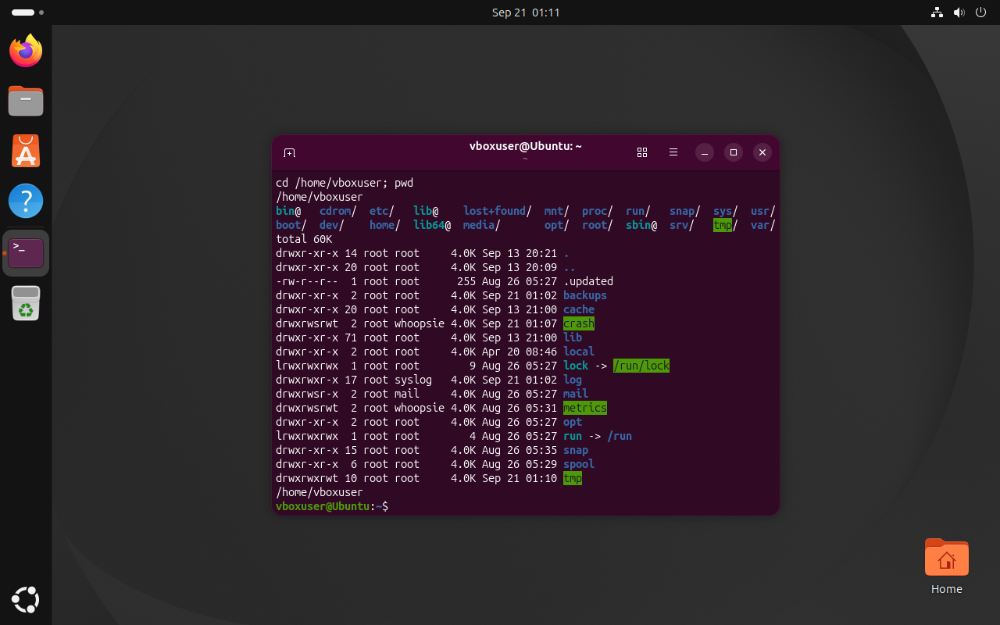
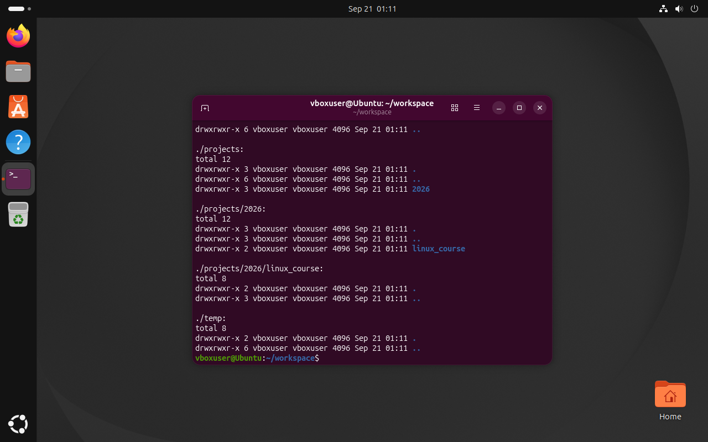
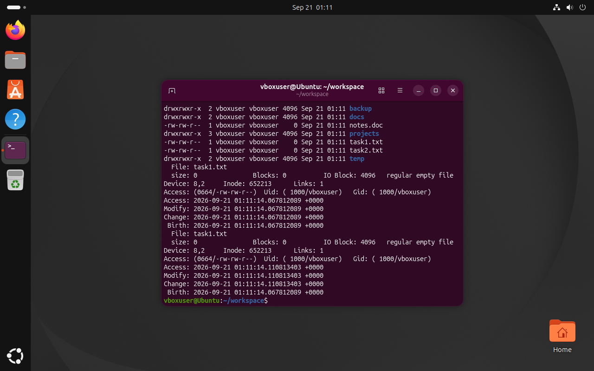
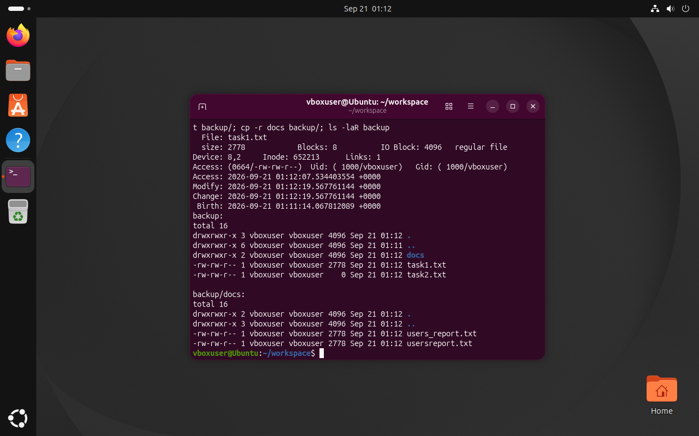
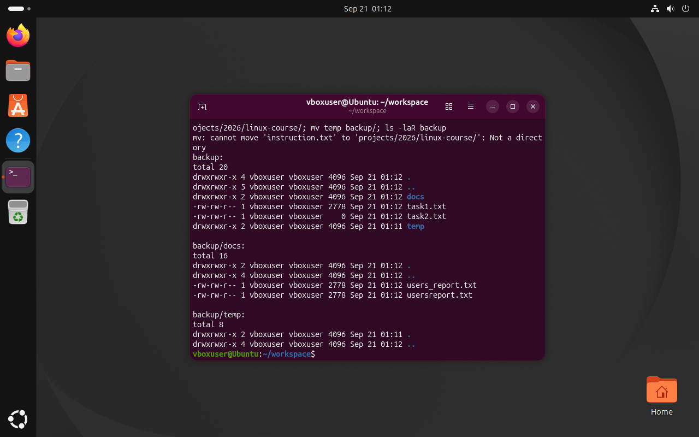
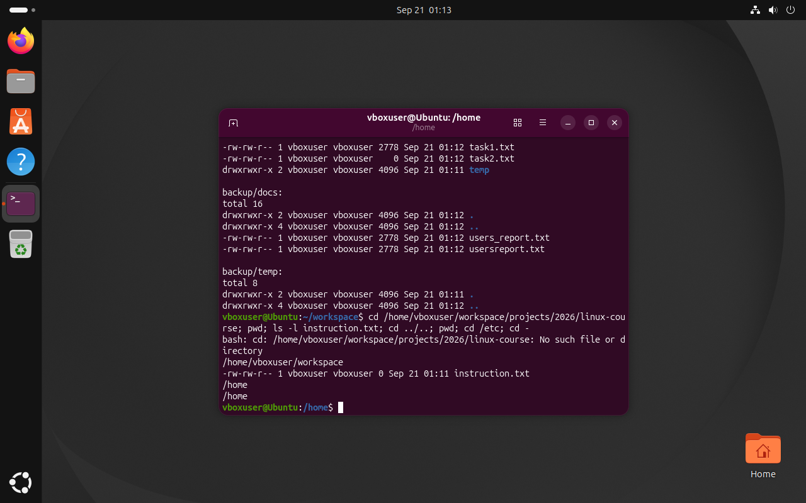
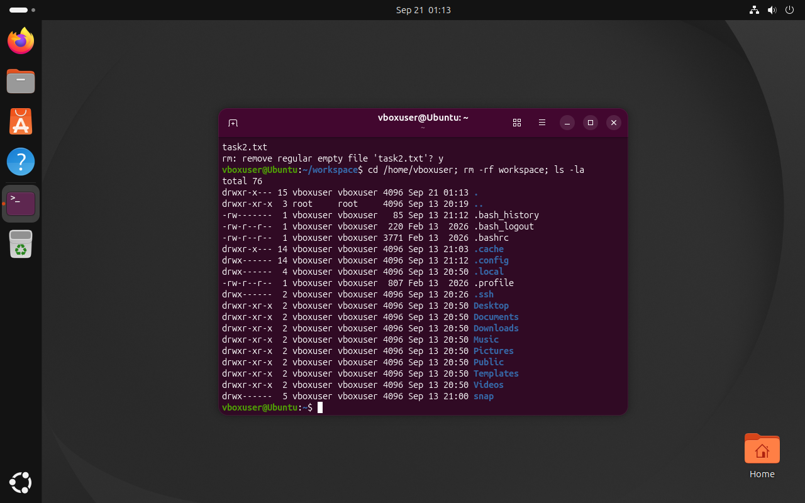

# Звіт з лабораторної роботи №2
**Тема:** Керування файлами та каталогами в Linux  
**Виконав:** Пінкевич Артем Романович  
**Група:** ІПЗ-32

## Мета роботи
Закріпити навички навігації файловою системою Linux, створення ієрархій
каталогів, роботи з файлами, часовими мітками, копіювання, переміщення та
безпечного видалення файлових об'єктів.

## Використані команди
Повний сценарій збережено у `lab02_commands.sh`. Він використовує:

- `pwd`, `cd`, `cd ~`, `cd -` — перегляд і зміну поточного каталогу;
- `ls -F`, `ls -lah`, `ls -laR` — перегляд вмісту з маркерами, розмірами,
  прихованими файлами та рекурсією;
- `mkdir -p` — створення дерева каталогів;
- `touch` — створення файлів і оновлення часу модифікації;
- `stat` — перегляд розміру і часових міток;
- `cat`, `cp`, `cp -i`, `cp -r` — запис і копіювання;
- `mv` — перейменування та переміщення;
- `rmdir`, `rm -i`, `rm -rf` — безпечне і рекурсивне видалення.

## Хід роботи

### Етап 1. FHS і навігація
Переглянуто кореневий каталог `/`, знайдено `/etc`, `/home`, `/var`.
Каталог `/var` переглянуто без переходу до нього командою `ls -lah /var`.

### Етап 2. Структура каталогів
У домашньому каталозі створено:

```text
workspace/
├── docs/
├── backup/
├── temp/
└── projects/2026/linux_course/
```

### Етап 3. Файли і таймстемпи
Створено `task1.txt`, `task2.txt`, `notes.doc`, прихований `.settings`.
Команда `stat` показала початковий розмір і часові мітки. Повторний `touch`
оновив час модифікації без зміни вмісту.

### Етап 4. Копіювання
Вміст `/etc/passwd` записано до `task1.txt`. Файл скопійовано до `docs` під
іменем `users_report.txt`, а також до `backup`. Виконано інтерактивне
копіювання `cp -i` та рекурсивне копіювання `docs`.

### Етап 5. Переміщення
`notes.doc` перейменовано на `instruction.txt`, переміщено до
`projects/2026/linux_course`. Каталог `temp` переміщено до `backup`.

### Етап 6. Відносні шляхи
З найглибшого каталогу виконано підйом на два рівні через `../..`, перехід
до `/etc` абсолютним шляхом і повернення командою `cd -`.

### Етап 7. Видалення
Порожній каталог видалено через `rmdir`. Спроба видалити непорожній `backup`
через `rmdir` завершується повідомленням про помилку. `task2.txt` видаляється
інтерактивно, а весь `workspace` — командою `rm -rf`.

## Відповіді на контрольні запитання
1. Абсолютний шлях починається від `/` і не залежить від поточного каталогу.
Відносний шлях обчислюється від поточного каталогу.
2. `touch` створює файл, якщо його немає, або оновлює часові мітки існуючого
файлу без зміни його вмісту.
3. Повне дерево створює опція `-p` команди `mkdir`.
4. `mv` змінює запис про розташування об'єкта, тому йому не потрібно обходити
вміст каталогу. `cp` і `rm` мають обробити вкладені об'єкти, тому потребують
рекурсивної опції.
5. `rmdir` видаляє лише порожні каталоги і є безпечнішим. `rm -rf` видаляє
рекурсивно без підтверджень, тому може призвести до втрати даних.

## Висновок
Виконано всі сім етапів роботи та закріплено навички керування файловою
системою Linux.

## Скріншоти
Скріншоти отримано з активної Ubuntu VM через VirtualBox:














