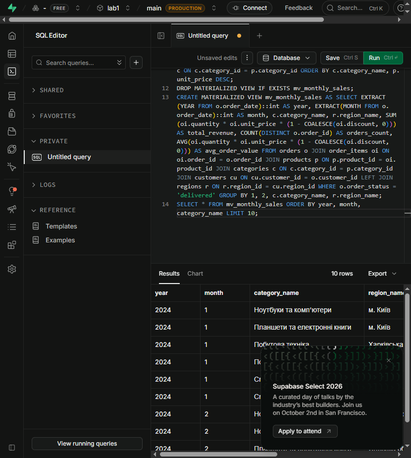

# Звіт з лабораторної роботи №2
**Тема:** Створення складних SQL-запитів  
**Виконав:** Пінкевич Артем Романович  
**Група:** ІПЗ-32  
**Рівень:** 3 (високий)

## Мета роботи
Набути навичок з'єднання таблиць, агрегування, підзапитів, віконних функцій,
CTE, матеріалізованих представлень та оптимізації запитів PostgreSQL.

## Програмне забезпечення
PostgreSQL у Supabase SQL Editor. Усі запити збережено у
`lab02_queries.sql`.

## Хід роботи
1. Виконано `INNER JOIN` для товарів, категорій і постачальників.
2. Виконано `LEFT JOIN` для виведення всіх клієнтів, включно з клієнтами без
замовлень.
3. Створено багатотабличний запит `orders → customers → order_items →
products → categories → suppliers`.
4. Застосовано `COUNT`, `SUM`, `AVG`, `MIN`, `MAX`, `GROUP BY`, `HAVING`.
5. Реалізовано корельований підзапит, `IN`, `EXISTS` та скалярний підзапит
у `SELECT`.
6. Для рівня 2 додано `RIGHT JOIN`, `FULL OUTER JOIN`, self-join
співробітників і умовне з'єднання.
7. Для ранжування використано `ROW_NUMBER`, `RANK`, `DENSE_RANK`, а для
порівняння замовлень — `LAG` і `LEAD` з `PARTITION BY`.
8. Для рівня 3 створено матеріалізоване представлення
`mv_monthly_sales`, рекурсивний CTE і параметризовану SQL-функцію
`product_analytics`.
9. Додано індекси та приклад `EXPLAIN (ANALYZE, BUFFERS)`.

У Supabase перевірено фактичну структуру навчальної БД: таблиці `categories`,
`customers`, `employees`, `order_items`, `orders`, `products`, `regions`,
`suppliers`, а також аналітичні представлення. Віконний запит повернув 25
рядків. Рекурсивний CTE побудував ієрархію з 8 співробітників. Матеріалізоване
представлення успішно створено, а вибірка з нього повернула 10 місячних
агрегатів. Параметризована функція створена без помилки.

## Оцінка складності
| Група запитів | Складність | Причина |
|---|---:|---|
| JOIN і прості агрегати | O(n)–O(n log n) | з'єднання та сортування |
| Корельований підзапит | O(n²) у гіршому випадку | підзапит виконується для рядків зовнішнього запиту |
| Віконні функції | O(n log n) | сортування всередині розділів |
| Рекурсивний CTE | O(V + E) без дорогого сортування | обхід ієрархії |
| Матеріалізоване представлення | одноразово дорого, читання швидке | результат збережений фізично |

## Оптимізація
- фільтрувати рядки до агрегації;
- індексувати зовнішні ключі й поля фільтрації;
- за можливості замінювати корельовані підзапити на JOIN/CTE;
- використовувати `EXPLAIN (ANALYZE, BUFFERS)`;
- оновлювати матеріалізоване представлення після зміни даних через
`REFRESH MATERIALIZED VIEW`.

## Відповіді на контрольні запитання
1. `INNER JOIN` повертає лише відповідні рядки з обох таблиць, а `LEFT JOIN`
зберігає всі рядки лівої таблиці і додає `NULL`, якщо відповідності немає.
2. `WHERE` працює до групування і не може фільтрувати агрегати. `HAVING`
застосовується після `GROUP BY` і може містити `COUNT`, `SUM` тощо.
3. Корельований підзапит використовує значення зовнішнього рядка і
виконується для кожного рядка. Наприклад, ним визначено товари, дорожчі за
середню ціну власної категорії.
4. Віконні функції доречні, коли треба зберегти всі рядки та додати до них
агрегат або ранг. `GROUP BY` натомість об'єднує рядки в один рядок групи.
5. Матеріалізоване представлення зберігає результат складного запиту
фізично, тому повторне читання аналітики швидше, ціною потреби в оновленні.
6. Для оптимізації використовуються рання фільтрація, індекси на ключах
з'єднання, аналіз плану та уникнення зайвих колонок.
7. `RANK()` пропускає ранг після однакових значень (`1, 2, 2, 4`), а
`DENSE_RANK()` не пропускає (`1, 2, 2, 3`).

## Висновок
Реалізовано всі завдання трьох рівнів складності для навчальної схеми
PostgreSQL. Запити можна виконувати послідовно у Supabase SQL Editor.

