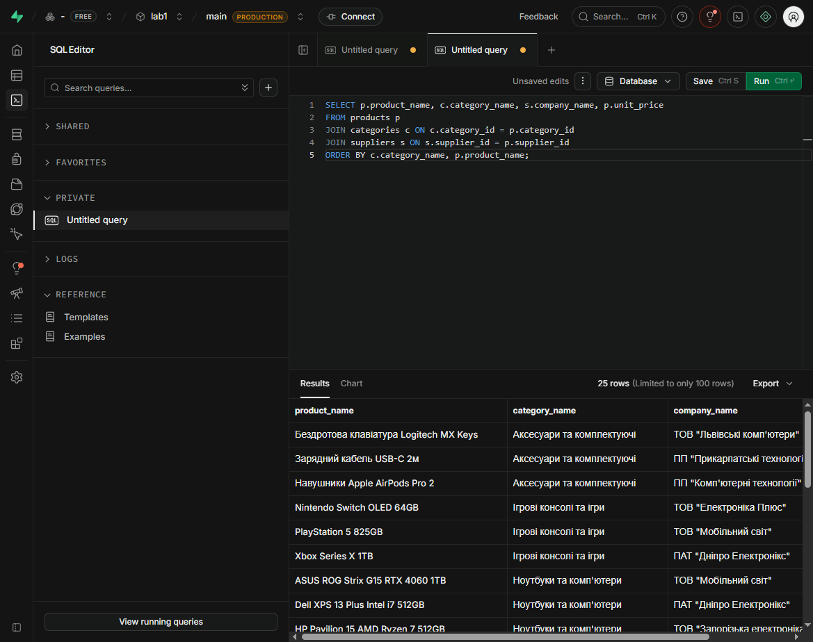
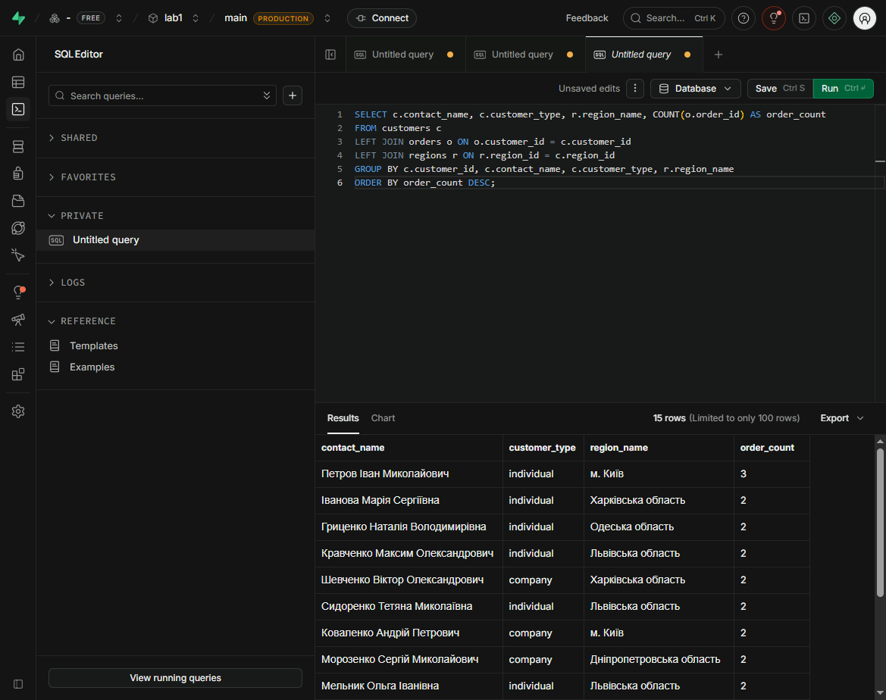
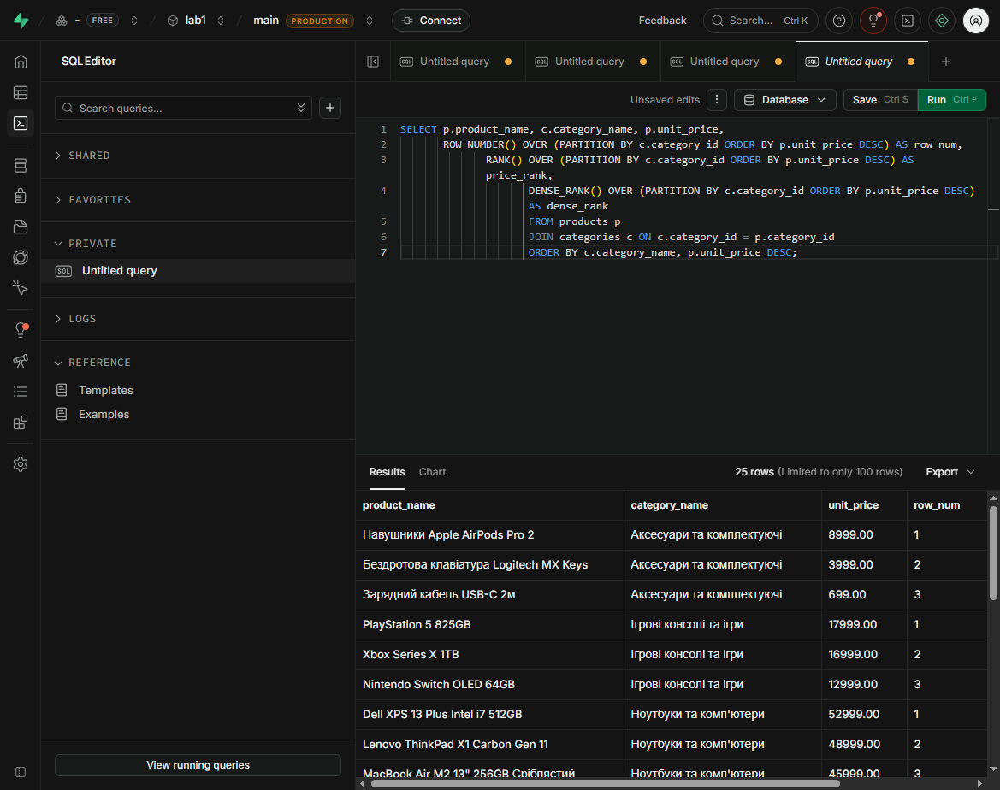

# Звіт з лабораторної роботи №2

**Тема:** Створення складних SQL-запитів  
**Виконав:** Пінкевич Артем Романович  
**Група:** ІПЗ-32  
**Рівень:** 3 (високий)  
**Середовище:** PostgreSQL / Supabase SQL Editor

## Мета роботи

Набути практичних навичок створення складних SQL-запитів: з'єднання таблиць, агрегування, підзапитів, віконних функцій, CTE, матеріалізованих представлень і базової оптимізації.

## Структура виконаної роботи

Усі запити та результати нижче зібрані в цьому єдиному файлі. Запити виконувалися послідовно в навчальній базі «ТехноМарт» у Supabase.

### Рівень 1 — JOIN та агрегування

1. **INNER JOIN:** товари, категорії та постачальники. Результат — 25 рядків.
2. **LEFT JOIN:** усі клієнти з кількістю замовлень, включно з клієнтами без замовлень. Результат — 15 рядків.
3. **Множинне з'єднання:** orders → customers → order_items → products → categories → suppliers.
4. **Агрегати:** COUNT, SUM, AVG, MIN, MAX, GROUP BY, HAVING.
5. **Підзапити:** корельований підзапит, IN, EXISTS, підзапит у SELECT.

### Рівень 2 — розширені з'єднання та аналітика

1. Реалізовано RIGHT JOIN, FULL OUTER JOIN, self-join співробітників і умовне з'єднання з додатковими умовами в ON.
2. Для ранжування використано ROW_NUMBER(), RANK(), DENSE_RANK().
3. Для порівняння замовлень клієнта використано LAG(), LEAD() і PARTITION BY.

### Рівень 3 — складна аналітика та оптимізація

1. Створено матеріалізоване представлення mv_monthly_sales; вибірка повернула 10 місячних агрегатів.
2. Реалізовано рекурсивний CTE для ієрархії співробітників; отримано ієрархію з 8 співробітників.
3. Створено параметризовану SQL-функцію product_analytics.
4. Додано індекси та виконано EXPLAIN (ANALYZE, BUFFERS).

## SQL-запити лабораторної роботи

Нижче наведено повний набір запитів, який раніше зберігався в окремому lab02_queries.sql. Тепер він є частиною цього звіту.

`sql
-- Лабораторна робота №2: складні SQL-запити (PostgreSQL / Supabase)
-- Схема відповідає навчальній БД "ТехноМарт" з ЛР1.

-- 1. JOIN
SELECT p.product_name, c.category_name, s.company_name, p.unit_price
FROM products p
JOIN categories c ON c.category_id = p.category_id
JOIN suppliers s ON s.supplier_id = p.supplier_id
ORDER BY c.category_name, p.product_name;

SELECT c.contact_name, c.customer_type, r.region_name, COUNT(o.order_id) AS order_count
FROM customers c
LEFT JOIN orders o ON o.customer_id = c.customer_id
LEFT JOIN regions r ON r.region_id = c.region_id
GROUP BY c.customer_id, c.contact_name, c.customer_type, r.region_name
ORDER BY order_count DESC;

SELECT o.order_id, o.order_date, cu.contact_name, p.product_name,
       c.category_name, s.company_name AS supplier, oi.quantity, oi.unit_price,
       oi.quantity * oi.unit_price * (1 - COALESCE(oi.discount, 0)) AS line_total
FROM orders o
JOIN customers cu ON cu.customer_id = o.customer_id
JOIN order_items oi ON oi.order_id = o.order_id
JOIN products p ON p.product_id = oi.product_id
JOIN categories c ON c.category_id = p.category_id
JOIN suppliers s ON s.supplier_id = p.supplier_id
ORDER BY o.order_date, o.order_id;

-- 2. Агрегація, GROUP BY, HAVING
SELECT c.category_name, COUNT(p.product_id) AS product_count,
       AVG(p.unit_price) AS avg_price, MIN(p.unit_price) AS min_price,
       MAX(p.unit_price) AS max_price
FROM categories c
LEFT JOIN products p ON p.category_id = c.category_id
GROUP BY c.category_id, c.category_name
ORDER BY product_count DESC;

SELECT r.region_name,
       SUM(oi.quantity * oi.unit_price * (1 - COALESCE(oi.discount, 0))) AS revenue
FROM orders o
JOIN customers cu ON cu.customer_id = o.customer_id
JOIN regions r ON r.region_id = cu.region_id
JOIN order_items oi ON oi.order_id = o.order_id
GROUP BY r.region_id, r.region_name
HAVING SUM(oi.quantity * oi.unit_price * (1 - COALESCE(oi.discount, 0))) > 0
ORDER BY revenue DESC;

SELECT s.company_name, COUNT(p.product_id) AS product_count
FROM suppliers s
LEFT JOIN products p ON p.supplier_id = s.supplier_id
GROUP BY s.supplier_id, s.company_name
HAVING COUNT(p.product_id) > 2
ORDER BY product_count DESC;

-- 3. Підзапити
SELECT p.product_name, p.unit_price, c.category_name
FROM products p JOIN categories c ON c.category_id = p.category_id
WHERE p.unit_price > (
    SELECT AVG(p2.unit_price) FROM products p2
    WHERE p2.category_id = p.category_id
);

SELECT customer_id, contact_name
FROM customers
WHERE customer_id IN (
    SELECT customer_id FROM orders
    WHERE order_date >= DATE '2024-01-01' AND order_date < DATE '2025-01-01'
);

SELECT p.product_name, p.unit_price,
       (SELECT COALESCE(SUM(oi.quantity), 0)
        FROM order_items oi WHERE oi.product_id = p.product_id) AS sold_quantity
FROM products p
ORDER BY sold_quantity DESC;

SELECT c.customer_id, c.contact_name
FROM customers c
WHERE EXISTS (
    SELECT 1 FROM orders o
    WHERE o.customer_id = c.customer_id AND o.order_status = 'delivered'
);

-- 4. Рівень 2: RIGHT/FULL OUTER JOIN, self-join, умовний JOIN
SELECT c.category_name, COUNT(p.product_id) AS products_count,
       COALESCE(AVG(p.unit_price), 0) AS avg_price
FROM products p RIGHT JOIN categories c ON p.category_id = c.category_id
GROUP BY c.category_id, c.category_name;

SELECT c.category_name, p.product_name
FROM categories c FULL OUTER JOIN products p ON p.category_id = c.category_id;

SELECT e1.first_name || ' ' || e1.last_name AS employee, e1.title AS employee_title,
       e2.first_name || ' ' || e2.last_name AS manager, e2.title AS manager_title
FROM employees e1
LEFT JOIN employees e2 ON e1.reports_to = e2.employee_id
ORDER BY e2.last_name, e1.last_name;

SELECT c.contact_name, o.order_id, o.order_date
FROM customers c
JOIN orders o ON o.customer_id = c.customer_id
            AND o.order_date >= DATE '2024-01-01'
            AND o.order_status = 'delivered';

-- 5. Віконні функції
SELECT p.product_name, c.category_name, p.unit_price,
       ROW_NUMBER() OVER (PARTITION BY c.category_id ORDER BY p.unit_price DESC) AS row_num,
       RANK() OVER (PARTITION BY c.category_id ORDER BY p.unit_price DESC) AS price_rank,
       DENSE_RANK() OVER (PARTITION BY c.category_id ORDER BY p.unit_price DESC) AS dense_rank
FROM products p JOIN categories c ON c.category_id = p.category_id
ORDER BY c.category_name, p.unit_price DESC;

SELECT customer_id, order_id, order_date, freight,
       LAG(order_date) OVER (PARTITION BY customer_id ORDER BY order_date) AS previous_order,
       LEAD(order_date) OVER (PARTITION BY customer_id ORDER BY order_date) AS next_order,
       freight - LAG(freight, 1, 0) OVER (PARTITION BY customer_id ORDER BY order_date) AS freight_change
FROM orders;

-- 6. Рівень 3: materialized view, recursive CTE, parameterized function
DROP MATERIALIZED VIEW IF EXISTS mv_monthly_sales;
CREATE MATERIALIZED VIEW mv_monthly_sales AS
SELECT EXTRACT(YEAR FROM o.order_date)::int AS year,
       EXTRACT(MONTH FROM o.order_date)::int AS month,
       c.category_name, r.region_name,
       SUM(oi.quantity * oi.unit_price * (1 - COALESCE(oi.discount, 0))) AS total_revenue,
       COUNT(DISTINCT o.order_id) AS orders_count,
       AVG(oi.quantity * oi.unit_price * (1 - COALESCE(oi.discount, 0))) AS avg_order_value
FROM orders o
JOIN order_items oi ON oi.order_id = o.order_id
JOIN products p ON p.product_id = oi.product_id
JOIN categories c ON c.category_id = p.category_id
JOIN customers cu ON cu.customer_id = o.customer_id
LEFT JOIN regions r ON r.region_id = cu.region_id
WHERE o.order_status = 'delivered'
GROUP BY 1, 2, c.category_name, r.region_name;
CREATE INDEX idx_mv_monthly_sales_date ON mv_monthly_sales(year, month);

WITH RECURSIVE employee_hierarchy AS (
    SELECT employee_id, first_name, last_name, title, reports_to, 0 AS level,
           (last_name || ' ' || first_name)::text AS hierarchy_path
    FROM employees WHERE reports_to IS NULL
    UNION ALL
    SELECT e.employee_id, e.first_name, e.last_name, e.title, e.reports_to,
           eh.level + 1, (eh.hierarchy_path || ' -> ' || e.last_name || ' ' || e.first_name)::text
    FROM employees e JOIN employee_hierarchy eh ON e.reports_to = eh.employee_id
    WHERE eh.level < 20
)
SELECT * FROM employee_hierarchy ORDER BY hierarchy_path;

CREATE OR REPLACE FUNCTION product_analytics(
    p_min_price numeric DEFAULT NULL,
    p_max_price numeric DEFAULT NULL,
    p_category_id integer DEFAULT NULL
) RETURNS TABLE(product_name text, unit_price numeric, category_id integer)
LANGUAGE sql AS $$
    SELECT p.product_name, p.unit_price, p.category_id
    FROM products p
    WHERE (p_min_price IS NULL OR p.unit_price >= p_min_price)
      AND (p_max_price IS NULL OR p.unit_price <= p_max_price)
      AND (p_category_id IS NULL OR p.category_id = p_category_id)
    ORDER BY p.unit_price DESC
$$;
-- SELECT * FROM product_analytics(10000, 50000, NULL);

-- 7. Оптимізація і EXPLAIN ANALYZE
CREATE INDEX IF NOT EXISTS idx_orders_customer_date ON orders(customer_id, order_date);
CREATE INDEX IF NOT EXISTS idx_products_category_price ON products(category_id, unit_price);
CREATE INDEX IF NOT EXISTS idx_order_items_product ON order_items(product_id);
EXPLAIN (ANALYZE, BUFFERS)
SELECT p.product_name, c.category_name, SUM(oi.quantity * oi.unit_price) AS revenue
FROM products p JOIN categories c ON c.category_id = p.category_id
JOIN order_items oi ON oi.product_id = p.product_id
GROUP BY p.product_name, c.category_name;

`

## Оцінка складності

- JOIN та прості агрегати: O(n)–O(n log n) залежно від плану з'єднання та сортування.
- Корельований підзапит: до O(n²) у найгіршому випадку; для оптимізації можна замінити його на JOIN або CTE.
- Віконні функції: зазвичай O(n log n) через сортування всередині розділів.
- Рекурсивний CTE: O(V + E) для обходу ієрархії без урахування додаткового сортування.
- Матеріалізоване представлення: складне обчислення виконується під час створення/оновлення, повторне читання значно дешевше.

## Оптимізація

- фільтрувати дані до агрегації;
- індексувати зовнішні ключі та поля, що використовуються у WHERE, JOIN і ORDER BY;
- замінювати корельовані підзапити на JOIN/CTE, якщо це покращує план;
- перевіряти фактичний план через EXPLAIN (ANALYZE, BUFFERS);
- оновлювати mv_monthly_sales через REFRESH MATERIALIZED VIEW після зміни даних;
- уникати SELECT * у production-запитах і повертати лише необхідні колонки.

## Відповіді на контрольні запитання

1. INNER JOIN повертає лише рядки з відповідністю в обох таблицях, а LEFT JOIN зберігає всі рядки лівої таблиці та додає NULL для відсутніх відповідностей.
2. WHERE виконується до групування, тому агрегати в ньому недоступні. HAVING фільтрує вже сформовані групи й може містити COUNT, SUM тощо.
3. Корельований підзапит використовує значення поточного рядка зовнішнього запиту; у роботі ним знайдено товари, дорожчі за середню ціну власної категорії.
4. Віконні функції використовують, коли потрібно зберегти всі рядки й додати ранг або агрегат. GROUP BY натомість згортає кожну групу до одного рядка.
5. Матеріалізоване представлення фізично зберігає результат запиту, пришвидшуючи повторну аналітику ціною потреби в оновленні.
6. Для оптимізації багатотабличних запитів потрібні рання фільтрація, індекси на ключах з'єднання, перевірка плану та відбір лише необхідних колонок.
7. RANK() пропускає номер після однакових значень (1, 2, 2, 4), а DENSE_RANK() — ні (1, 2, 2, 3).

## Висновок

Усі завдання трьох рівнів складності реалізовано для навчальної PostgreSQL-бази. Звіт містить SQL-код, опис результатів, оцінку складності, рекомендації з оптимізації та скріншоти виконання в Supabase.

**Самооцінка:** 5/5
